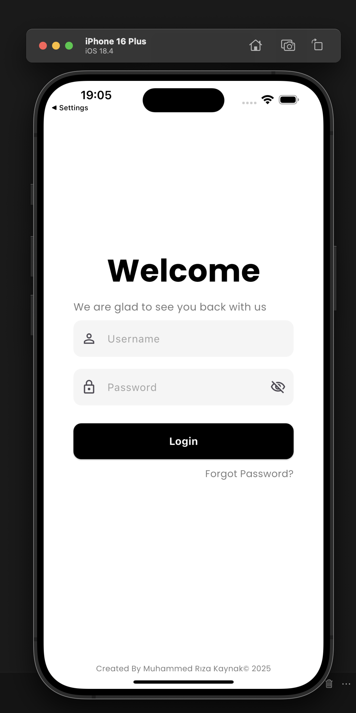

# Admin Panel

A modern and responsive admin panel built with Flutter, designed to work seamlessly across both web (Chrome) and mobile platforms.

## 📱 Screenshots

### Web Version (Chrome)


### Mobile Version



## 🚀 Getting Started

### Prerequisites

- Flutter SDK (latest version)
- Dart SDK
- Android Studio / VS Code
- Chrome (for web development)

### Installation

1. Clone the repository
```bash
git clone https://github.com/mamipro-123/flutter-admin-panel.git
```

2. Navigate to project directory
```bash
cd admin_panel
```

3. Install dependencies
```bash
flutter pub get
```

4. Run the app
```bash
flutter run
```

## 🛠️ Built With

- [Flutter](https://flutter.dev/) - UI Framework
- [Dart](https://dart.dev/) - Programming Language

## 📄 License

This project is licensed under the MIT License - see the [LICENSE](LICENSE) file for details.

## 👥 Authors

- Muhammed Rıza Kaynak - Initial work

## 🙏 Acknowledgments

- Flutter team for the amazing framework
- All contributors who have helped this project grow
